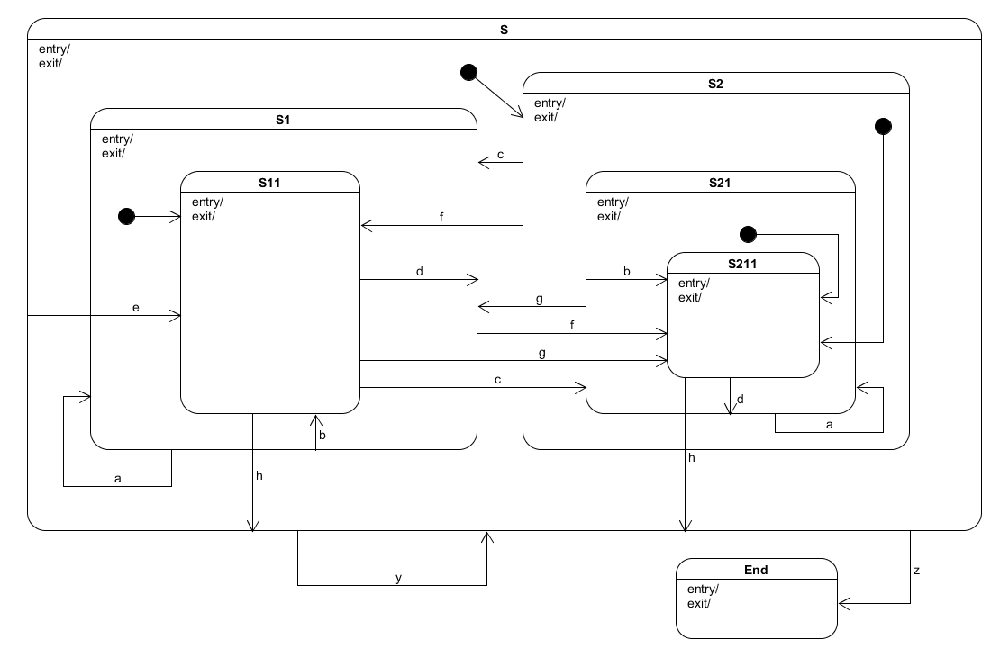

sequence
========

from this:

      [2013-3-24 12:15:5.201] [this_process] cTrig->begin() spec->statechart
      [2013-3-24 12:15:5.201] [this_process] cTrig->prototype() statechart->code
      [2013-3-24 12:15:5.205] [this_process] cTrig->debug() code->code
      [2013-3-24 12:15:5.205] [this_process] cTrig->communicate() code->trace
      [2013-3-24 12:15:5.205] [this_process] cTrig->sequence.rb() trace->sequence_diagram

to this:

      [ Chart: this_process ] (?)
            spec          statechart          code             trace      sequence_diagram 
              +----begin()---->|                |                |                |
              |      (?)       |                |                |                |
              |                +--prototype()-->|                |                |
              |                |      (?)       |                |                |
              |                |                +                |                |
              |                |                 \ (?)           |                |
              |                |                 debug()         |                |
              |                |                 /               |                |
              |                |                <                |                |
              |                |                +-communicate()->|                |
              |                |                |      (?)       |                |
              |                |                |                +-sequence.rb()->|
              |                |                |                |      (?)       |


**sequence.rb** is a sequence diagram writer, written in Ruby.  It converts statechart trace logs
into an ASCII sequence diagram.

Sequence command line
=====================

    > ruby sequence.rb -i "trace.txt" -o "sequence_diagram.txt"

If your **trace.txt** file contained:

      [2013-3-24 12:15:5.201] [00] cTrig->g() S211->S11
      [2013-3-24 12:15:5.201] [00] cTrig->f() S11->S211
      [2013-3-24 12:15:5.205] [00] cTrig->e() S211->S11
      [2013-3-24 12:15:5.206] [00] cTrig->d() S11->S11
      [2013-3-24 12:15:5.206] [00] cTrig->c() S11->S211
      [2013-3-24 12:15:5.208] [00] cTrig->b() S211->S211
      [2013-3-24 12:15:5.209] [00] cTrig->a(Erker!) S211->S211


The **sequence_diagram.txt** would look like this:

      [ Chart: 00 ] (?)
          S211          S11
            +----g()---->|
            |    (?)     |
            +<---f()-----|
            |    (?)     |
            +----e()---->|
            |    (?)     |
            |            +
            |             \ (?)
            |             d()
            |             /
            |            <
            +<---c()-----|
            |    (?)     |
            +            |
             \ (?)       |
             b()         |
             /           |
            <            |
            +            |
             \ (?)       |
             a(Erker!)   |
             /           |
            <            |

Example with a statechart and its trace output
===============================================

Suppose the above [statechart](https://github.com/aleph2c/miros) was started in state S, then was sent the following
series of events:

  **{a, b, c, d, e, f, g, h, g, f, e, d, c, b, a}**

This could generate the following trace.

    [2016-05-26 10:31:08.828] [example_chart] event->entry() top->S211
    [2016-05-26 10:31:08.832] [example_chart] event->a() S211->S211
    [2016-05-26 10:31:08.833] [example_chart] event->b() S211->S211
    [2016-05-26 10:31:08.836] [example_chart] event->c() S211->S11
    [2016-05-26 10:31:08.838] [example_chart] event->d() S11->S11
    [2016-05-26 10:31:08.839] [example_chart] event->e() S11->S11
    [2016-05-26 10:31:08.841] [example_chart] event->f() S11->S211
    [2016-05-26 10:31:08.844] [example_chart] event->g() S211->S11
    [2016-05-26 10:31:08.847] [example_chart] event->h() S11->S211
    [2016-05-26 10:31:08.849] [example_chart] event->g() S211->S11
    [2016-05-26 10:31:08.851] [example_chart] event->f() S11->S211
    [2016-05-26 10:31:08.853] [example_chart] event->e() S211->S11
    [2016-05-26 10:31:08.854] [example_chart] event->d() S11->S11
    [2016-05-26 10:31:08.857] [example_chart] event->c() S11->S211
    [2016-05-26 10:31:08.858] [example_chart] event->b() S211->S211
    [2016-05-26 10:31:08.860] [example_chart] event->a() S211->S211

If the above trace was in the **trace.txt** file, you could run:

    > ruby sequence.rb -i "trace.txt" -o "sequence_diagram.txt"

The resulting **sequence_diagram.txt** file would look like this:

    [ Chart: example_chart ] (?)
        top       S211        S11    
         +-entry()->|          |
         |   (?)    |          |
         |          +          |
         |           \ (?)     |
         |           a()       |
         |           /         |
         |          <          |
         |          +          |
         |           \ (?)     |
         |           b()       |
         |           /         |
         |          <          |
         |          +---c()--->|
         |          |   (?)    |
         |          |          +          
         |          |           \ (?)     
         |          |           d()       
         |          |           /         
         |          |          <          
         |          |          +          
         |          |           \ (?)     
         |          |           e()       
         |          |           /         
         |          |          <          
         |          +<--f()----|
         |          |   (?)    |
         |          +---g()--->|
         |          |   (?)    |
         |          +<--h()----|
         |          |   (?)    |
         |          +---g()--->|
         |          |   (?)    |
         |          +<--f()----|
         |          |   (?)    |
         |          +---e()--->|
         |          |   (?)    |
         |          |          +          
         |          |           \ (?)     
         |          |           d()       
         |          |           /         
         |          |          <          
         |          +<--c()----|
         |          |   (?)    |
         |          +          |
         |           \ (?)     |
         |           b()       |
         |           /         |
         |          <          |
         |          +          |
         |           \ (?)     |
         |           a()       |
         |           /         |
         |          <          |
   
Sequence can deal with noise
============================
Suppose your **trace.txt** file was filled with trace information interleaved
with spy output (engineering noise):

    spy(top-entry);                                                                            
    spy(top-init);                                                                             
    spy(d2-entry);                                                                             
    spy(d2-init);                                                                              
    spy(d21-entry);                                                                            
    spy(d211-entry);                                                                           
    [2016-05-25 11:36:48] [under_test] event->entry() top->d211                                    
    spy(d21-a-{'y': 0, 'x': 0, 'z': 0, 'tik': 0});                                             
    spy(d211-exit-{'y': 0, 'x': 0, 'z': 0, 'tik': 1});                                         
    spy(d21-exit-{'y': 0, 'x': 0, 'z': 0, 'tik': 2});                                          
    spy(d21-entry-{'y': 0, 'x': 0, 'z': 0, 'tik': 3});                                         
    spy(d21-init-{'y': 0, 'x': 0, 'z': 0, 'tik': 4});                                          
    spy(d211-entry-{'y': 0, 'x': 0, 'z': 0, 'tik': 5});                                        
    [2016-05-25 11:36:48] [under_test] event->a({'y': 0, 'x': 0, 'z': 0, 'tik': 6}) d211->d211     
    spy(d21-b);                                                                                
    spy(d211-exit);                                                                            
    spy(d211-entry);                                                                           
    
A run of **sequence.rb** would generate the following:


    [ Chart: under_test ] (?)
                       top                                     d211                   
                        +----------------entry()---------------->|
                        |                  (?)                   |
                        |                                        +                                        
                        |                                         \ (?)                                   
                        |                                         a({'y': 0, 'x': 0, 'z': 0, 'tik': 6})   
                        |                                         /                                       
                        |                                        <                                        


Sequence can document concurrent statecharts
============================================
Suppose you would like to document how two concurrent statecharts are working
together.  First you would have their trace output interleaved in a **trace.txt** file:

    [2016-02-18 08:21:25] [31] uiErrNum->2 siErrVal->555 FAULT: AC Output Over Voltage
    [2016-02-18 08:21:25] [31] Trig->BB(514) ActiveTestComplete->InvertRampDown
    [2016-02-18 08:21:25] [00] uiErrNum->74 siErrVal->0 FAULT: Other Unit Invert Fault
    [2016-02-18 08:21:25] [00] Trig->BB(514) InvertSupport->QualifyingAC
    [2016-02-18 08:21:25] [00] Trig->N(559) EngagingInvertSupport->InvertSupport
    [2016-02-18 08:21:25] [00] Trig->Init(3) QualifyingAC->InvertSelect
    [2016-02-18 08:21:25] [00] Trig->Init(3) InvertSelect->EngagingInvertSupport
    [2016-02-18 08:21:26] [31] Trig->IRDC(646) InvertRampDown->QualifyingAC
    [2016-02-18 08:21:40] [31] Trig->DD(51) QualifyingAC->QualifyingAC
    [2016-02-18 08:21:40] [31] Trig->N(559) EngagingInvert->EngagingInvert
    [2016-02-18 08:21:40] [31] Trig->Init(3) QualifyingAC->InvertSelect
    [2016-02-18 08:21:40] [31] Trig->Init(3) InvertSelect->EngagingInvert
    [2016-02-18 08:21:40] [31] Trig->BFT(651) Invert->ActiveTestofRelays 
    [2016-02-18 08:21:42] [31] Trig->BFTC(652) ActiveTestofRelays->ActiveTestComplete
    [2016-02-18 08:21:42] [00] Trig->DD(51) InvertSupport->QualifyingAC
    [2016-02-18 08:21:42] [00] Trig->Init(3) QualifyingAC->InvertSelect
    [2016-02-18 08:21:42] [00] Trig->Init(3) InvertSelect->EngagingInvertSupport
    [2016-02-18 08:21:42] [00] Trig->N(559) EngagingInvertSupport->InvertSupport


Then you would run **sequence.rb** to generate the following output:

    [ Chart: 31 ] (?)
    ActiveTestComplete   InvertRampDown      QualifyingAC       InvertSelect      EngagingInvert         Invert       ActiveTestofRelays 
             +-----BB(514)----->|                  |                  |                  |                  |                  |
             |       (?)        |                  |                  |                  |                  |                  |
             |                  +----IRDC(646)---->|                  |                  |                  |                  |
             |                  |       (?)        |                  |                  |                  |                  |
             |                  |                  +                  |                  |                  |                  |
             |                  |                   \ (?)             |                  |                  |                  |
             |                  |                   DD(51)            |                  |                  |                  |
             |                  |                   /                 |                  |                  |                  |
             |                  |                  <                  |                  |                  |                  |
             |                  |                  +-----Init(3)----->|                  |                  |                  |
             |                  |                  |       (?)        |                  |                  |                  |
             |                  |                  |                  +-----Init(3)----->|                  |                  |
             |                  |                  |                  |       (?)        |                  |                  |
             |                  |                  |                  |                  +                  |                  |
             |                  |                  |                  |                   \ (?)             |                  |
             |                  |                  |                  |                   N(559)            |                  |
             |                  |                  |                  |                   /                 |                  |
             |                  |                  |                  |                  <                  |                  |
             |                  |                  |                  |                  |                  +----BFT(651)----->|
             |                  |                  |                  |                  |                  |       (?)        |
             +<-----------------+------------------+------------------+------------------+------------------+----BFTC(652)-----|
             |                  |                  |                  |                  |                  |       (?)        |
    
    [ Chart: 00 ] (?)
        InvertSupport        QualifyingAC         InvertSelect     EngagingInvertSupport
              +------BB(514)------>|                    |                    |
              |        (?)         |                    |                    |
              |                    +------Init(3)------>|                    |
              |                    |        (?)         |                    |
              |                    |                    +------Init(3)------>|
              |                    |                    |        (?)         |
              +<-------------------+--------------------+------N(559)--------|
              |                    |                    |        (?)         |
              +------DD(51)------->|                    |                    |
              |        (?)         |                    |                    |
              |                    +------Init(3)------>|                    |
              |                    |        (?)         |                    |
              |                    |                    +------Init(3)------>|
              |                    |                    |        (?)         |
              +<-------------------+--------------------+------N(559)--------|
              |                    |                    |        (?)         |

You could update all of the **?** locations with numbers so that you could
describe what is going on in your documentation.  The ASCII art can be placed
directly in your code or markdown.

Integrating sequence.rb with Vim
================================
Who wants to run a command line script when you could just select your trace and
press a hotkey and output the sequence diagram directly into your document?  If
you feel the need for speed, put the following into your .vimrc file.
      
```vimscript
      """"""""""""""""""""""""""""""""""""""""""""""""""""""""""""""""""""""""""""""""
      "               Get the number of lines from a visual selection                "
      """"""""""""""""""""""""""""""""""""""""""""""""""""""""""""""""""""""""""""""""
      function! s:get_lines_from_visual_selection()
        let [lnum1, col1] = getpos("'<")[1:2]
        let [lnum2, col2] = getpos("'>")[1:2]
        return getline(lnum1,lnum2)
      endfunction

      """"""""""""""""""""""""""""""""""""""""""""""""""""""""""""""""""""""""""""""""
      "           Write a visual selection to file, given that file's name           "
      """"""""""""""""""""""""""""""""""""""""""""""""""""""""""""""""""""""""""""""""
      function! s:write_visual_selection_to_file(file_name)
        let file_name = a:file_name
        let input_strings = s:get_lines_from_visual_selection()
        return writefile(input_strings,file_name)
      endfunction

      """"""""""""""""""""""""""""""""""""""""""""""""""""""""""""""""""""""""""""""""
      "          Convert a visually selected trace into a Sequence Diagram           "
      """"""""""""""""""""""""""""""""""""""""""""""""""""""""""""""""""""""""""""""""
      function! s:call_trace_to_sequence_diagram(file_in_which_to_write_trace, diagram_output_file_name)
          let s:path_to_sequence = 'C:/github/sequence/sequence.rb'
          normal mz

          let diagram_output_file_name = a:diagram_output_file_name
          let diagram_input_file_name  = a:file_in_which_to_write_trace
          call s:write_visual_selection_to_file(diagram_input_file_name)
          " write the trace to file
          call system("ruby " . s:path_to_sequence . " -i ".diagram_input_file_name. " -o " .diagram_output_file_name )
          " write the trace to the @t register
          let @t = system("ruby ". s:path_to_sequence . " -i ".diagram_input_file_name )
          " remove our input and output files
          call delete(diagram_input_file_name)
          call delete(diagram_output_file_name)
          " put the @t register into our buffer at the bottom of the current selection
          normal `>
          normal o
          put! t
          normal `z
          " place the cursor at the first '?' so that we can start over-writing
          " our '?' characters with numbers
          call search( "?")
          normal zt
          return 0
      endfunction

      command! -range TraceToSequenceDiagram call s:call_trace_to_sequence_diagram("__trace.txt__","__sequence_diagram.txt__")

      vnoremap <leader><c-t> :TraceToSequenceDiagram<CR>
```

Change the pathing of **'C:/github/sequence/sequence.rb'** to where you have placed
the 'sequence.rb' file on your system. Save and source your .vimrc file.  Now
copy some trace output into a buffer, select it, then hit <leader><c-t>.  You
should see that's its sequence diagram is placed after your trace log.

FAQ
===
Why did you write sequence.rb in Ruby and miros in Python?

> I didn't write miros, I extended it.  I used miros to learn Python.  I wrote
> sequence.rb before I learned Python.

Are you going to port sequence.rb to Python?

> If people ask for it.
